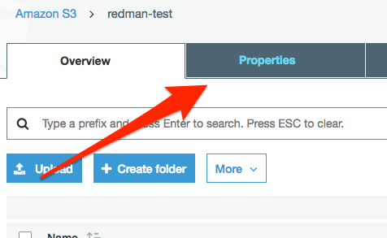
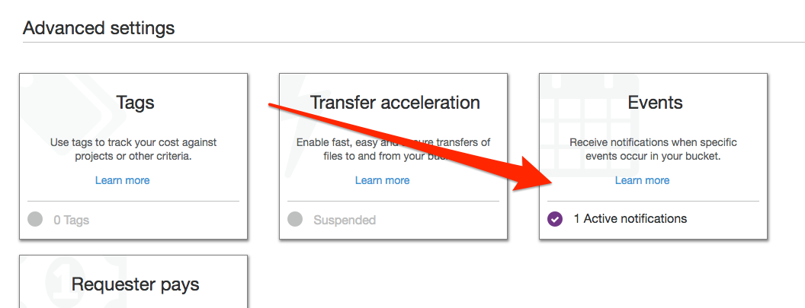
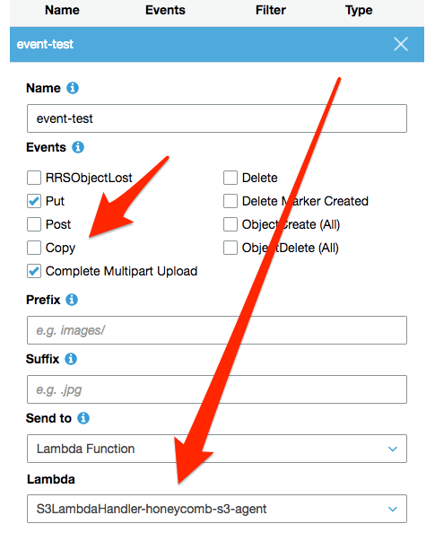

# Honeycomb Agentless Integrations for AWS

This is a collection of AWS Lambda-based integrations packaged in AWS Cloudformation, designed to help you get data from AWS services without the need to run a server-based agent. The currently supported data sources are Cloudwatch Logs and S3. We hope to support more AWS services in the future - your feedback will help us know which services to add support for first.

This is a BETA - there may still be some bugs, and behavior may change in the future. We're also working to refine the installation process to get you going even faster!

## Current Features

- Generic JSON integration for Cloudwatch Logs
- Generic RegEx integration for Cloudwatch Logs
- VPC Flow Log integration for Cloudwatch Logs
- Generic JSON integration for S3 Logs
- AWS ELB integration for S3 Logs
- S3 Bucket Log integration for S3 Logs

## Installation

### Generic JSON integration for Cloudwatch

[Click here](https://console.aws.amazon.com/cloudformation/home?region=us-east-1#/stacks/new?stackName=honeycomb-cloudwatch-integration&templateURL=https://s3.amazonaws.com/honeycomb-builds/honeycombio/integrations-for-aws/LATEST/templates/cloudwatch-logs-json.yml) to launch the AWS Cloudformation Console to create the integration stack. You will need one stack per Cloudwatch Log Group. The integration is configured using Cloudformation parameters, and for this template you will need to supply the following parameters:

- Stack Name
- Cloudwatch Log Group Name
- Your honeycomb write key (optionally encrypted)
- Target honeycomb dataset

Optional inputs include:

- Sample rate
- The ID of the AWS Key Management Service key used to encrypt your write key. If your write key is not encrypted, do not set a value here

### Generic JSON integration for S3

[Click here](https://console.aws.amazon.com/cloudformation/home?region=us-east-1#/stacks/new?stackName=honeycomb-s3-integration&templateURL=https://s3.amazonaws.com/honeycomb-builds/honeycombio/integrations-for-aws/LATEST/templates/s3-logs-json.yml) to launch the AWS Cloudformation Console to create the integration stack. You will need one stack per S3 bucket that you want to subscribe to. The integration is configured using Cloudformation parameters, and for this template you will need to supply the following parameters:

- Stack Name
- Cloudwatch Log Group Name
- Your honeycomb write key (optionally encrypted)
- Target honeycomb dataset

Optional inputs include:

- Sample rate
- The ID of the AWS Key Management Service key used to encrypt your write key. If your write key is not encrypted, do not set a value here

#### Sending S3 events to Lambda

After your stack is created, you will need to manually configure your bucket to send PutObject and Upload events to Lambda.

From the AWS console, select the bucket that you want to subscribe to and select __Properties__:



Find __Advanced Settings__ and click __Events__:



Enable events __Put__ and __Complete Multipart Upload__ and select the lambda belonging to the honeycomb s3 integration. If you have multiple integrations, remember to select the integration belonging to the stack that has permissions to access your bucket. You can optionally set a prefix and suffix, if you only want a subset of objects to be processed by your lambda. This is recommended if the bucket has multiple uses.



### Generic JSON integration for SNS

[Click here](https://console.aws.amazon.com/cloudformation/home?region=us-east-1#/stacks/new?stackName=honeycomb-sns-integration&templateURL=https://s3.amazonaws.com/honeycomb-builds/honeycombio/integrations-for-aws/LATEST/templates/sns-json.yml) to launch the AWS Cloudformation Console to create the integration stack. You will need one stack per SNS topic that you want to subscribe to.

### Other integrations

#### VPC Flow Log Integration

The VPC flow log integration uses the regex integration with predefined inputs that work for VPC flow logs.

[Click here to install the VPC Flow Log Integration](https://console.aws.amazon.com/cloudformation/home?region=us-east-1#/stacks/new?stackName=honeycomb-vpc-flow-logs&templateURL=https://s3.amazonaws.com/honeycomb-builds/honeycombio/integrations-for-aws/LATEST/templates/vpc-flow-logs.yml)

#### Generic RegEx Integration for Cloudwatch

The generic regex integration accepts arbitrary regex ([re2](https://github.com/google/re2/wiki/Syntax)) to use to parse each line. Honeycomb columns are generated by defining named capture groups. For example, `(?P<name>re)` would create a column called "name" if successfully parsed.

[Click here to install the Generic Regex Integration](https://console.aws.amazon.com/cloudformation/home?region=us-east-1#/stacks/new?stackName=honeycomb-cloudwatch-integration&templateURL=https://s3.amazonaws.com/honeycomb-builds/honeycombio/integrations-for-aws/LATEST/templates/cloudwatch-logs-regex.yml)

#### AWS ELB Integration for S3 Logs

Used to parse ELB logs, which are saved to S3 periodically by the ELB service.

[Click here to install the AWS ELB Integration](https://console.aws.amazon.com/cloudformation/home?region=us-east-1#/stacks/new?stackName=honeycomb-elb-log-integration&templateURL=https://s3.amazonaws.com/honeycomb-builds/honeycombio/integrations-for-aws/LATEST/templates/aws-elb-logs.yml)

After this is installed, you will need to manually configure your ELB log bucket to send events to the lambda function. See instructions above for __Sending S3 events to Lambda__.

#### AWS S3 Bucket Logs Integration

This is used to parse S3 server access logs, which, if configured, are written to another bucket periodically by the S3 service.

[Click here to install the AWS S3 Bucket Log Integration](https://console.aws.amazon.com/cloudformation/home?region=us-east-1#/stacks/new?stackName=honeycomb-s3-bucket-log-integration&templateURL=https://s3.amazonaws.com/honeycomb-builds/honeycombio/integrations-for-aws/LATEST/templates/s3-bucket-logs.yml)

## How it works

### Cloudwatch

The Cloudformation template creates the following resources:

- An AWS Lambda Function
- An IAM role and policy used by the Lambda function. This role grants the Lambda function the ability to write to Cloudwatch (for its own logging) and to decrypt your write key using the provided KMS key (if applicable)
- A Lambda Permission granting Cloudwatch the ability to invoke this function
- A Cloudwatch Subscription Filter, which invokes this function when new Cloudwatch log events are received

When an event is written to the subscribed Cloudwatch Log Group, it is forwarded to the Honeycomb Lambda function, which parses the log line and forwards it to Honeycomb.

### S3

The Cloudformation template creates the following resources:

- An AWS Lambda Function
- An IAM role and policy used by the Lambda function. This role grants the Lambda function the ability to write to Cloudwatch (for its own logging), retrieve objects from the specified bucket, and decrypt your write key using the provided KMS key (if applicable).
- A Lambda Permission granting S3 the ability to invoke this function

When an object is uploaded to your bucket, an S3 event object is passed to the lambda function. The lambda function invokes `S3:GetObject` on the object, retrieves its contents, and parses them line by line.

#### CAVEATS

Lambda's execution time is capped at 5 minutes. If you upload sufficiently large logs (in the 100s of megabytes or more), the function may not process all events before Lambda times out. It's best to submit your logs in smaller chunks - Lambda can scale to process more logs better than it can scale to process larger logs.

Increasing the MemorySize of the Lambda also increases its CPU allocation. If you are unable to break up your logs into smaller objects, and you find that the logs aren't being processed in the allowed 5 minutes, increasing MemorySize can lead to faster processing of events.

## Encrypting your Write Key

When installing the integration, you must supply your honeycomb write key via Cloudformation parameter. Cloudformation parameters are not encrypted, and are plainly viewable to anyone with access to your Cloudformation stacks. For this reason, we strongly recommend that your Honeycomb write key be encrypted. To encrypt your key, use AWS's KMS service.

First, you'll need to create a KMS key if you don't have one already. The default account keys are not suitable for this use case.

```
$ aws kms create-key --description "used to encrypt secrets"
{
    "KeyMetadata": {
        "AWSAccountId": "123455678910",
        "KeyId": "a38f80cc-19b5-486a-a163-a4502b7a52cc",
        "Arn": "arn:aws:kms:us-east-1:123455678910:key/a38f80cc-19b5-486a-a163-a4502b7a52cc",
        "CreationDate": 1524160520.097,
        "Enabled": true,
        "Description": "used to encrypt honeycomb secrets",
        "KeyUsage": "ENCRYPT_DECRYPT",
        "KeyState": "Enabled",
        "Origin": "AWS_KMS",
        "KeyManager": "CUSTOMER"
    }
}
$ aws kms create-alias --alias-name alias/secrets_key --target-key-id=a38f80cc-19b5-486a-a163-a4502b7a52cc
```

Now you're ready to encrypt your Honeycomb write key:

```
$ aws kms encrypt --key-id=a38f80cc-19b5-486a-a163-a4502b7a52cc --plaintext "thisismyhoneycombkey"
{
    "CiphertextBlob": "AQICAHge4+BhZ1sURk1UGUjTZxmcegPXyRqG8NCK8/schk381gGToGRb8n3PCjITQPDKjxuJAAAAcjBwBgkqhkiG9w0BBwagYzBhAgEAMFwGCSqGSIb3DQEHATAeBglghkgBZQMEAS4wEQQM0GLK36ChLOlHQiiiAgEQgC9lYlR3qvsQEhgILHhT0eD4atgdB7UAMW6TIAJw9vYsPpnbHhqhO7V8/mEa9Iej+g==",
    "KeyId": "arn:aws:kms:us-east-1:702835727665:key/a38f80cc-19b5-486a-a163-a4502b7a52cc"
}
```

Record the `CiphertextBlob` and the Key ID - this is what you'll pass to the Cloudformation templates.

## Advanced Installation Steps

## Terraform

See the `terraform` directory in this repo for examples of Terraform configs.

### Building the stack with the AWS CLI

If you need to turn up several stacks, or just don't like the Cloudformation UI, use the [AWS CLI](https://aws.amazon.com/cli/) and the script below. You'll also find this script under `examples/deploy-generic-json.sh`. You'll need to update values for `STACK_NAME`, `LOG_GROUP_NAME`, `HONEYCOMB_WRITE_KEY`, `KMS_KEY_ID`.

```bash
#!/bin/bash
ENVIRONMENT=production
STACK_NAME=CHANGEME
# change this to the log group name used by your application
LOG_GROUP_NAME=/change/me
# this is the base64-encoded KMS encrypted CiphertextBlob containing your write key
# To encrypt your key, run `aws kms encrypt --key-id $MY_KMS_KEY_ID --plaintext "$MY_HONEYCOMB_KEY"`
# paste the CyphertextBlob here
HONEYCOMB_WRITE_KEY=changeme
# this is the KMS Key ID used to encrypt the write key above
# try running `aws kms list-keys` - you want the UID after ":key/" in the ARN
KMS_KEY_ID=changeme
DATASET="cloudwatch-logs"
HONEYCOMB_SAMPLE_RATE="1"
TEMPLATE="file://./templates/cloudwatch-logs-json.yml"

JSON=$(cat << END
{
    "StackName": "${STACK_NAME}",
    "Parameters": [
        {
            "ParameterKey": "Environment",
            "ParameterValue": "${ENVIRONMENT}"
        },
        {
            "ParameterKey": "HoneycombWriteKey",
            "ParameterValue": "${HONEYCOMB_WRITE_KEY}"
        },
        {
            "ParameterKey": "KMSKeyId",
            "ParameterValue": "${KMS_KEY_ID}"
        },
        {
            "ParameterKey": "HoneycombDataset",
            "ParameterValue": "${DATASET}"
        },
        {
            "ParameterKey": "HoneycombSampleRate",
            "ParameterValue": "${HONEYCOMB_SAMPLE_RATE}"
        },
        {
            "ParameterKey": "LogGroupName",
            "ParameterValue": "${LOG_GROUP_NAME}"
        },
        {
            "ParameterKey": "TimeFieldName",
            "ParameterValue": ""
        },
        {
            "ParameterKey": "TimeFieldFormat",
            "ParameterValue": ""
        }
    ],
    "Capabilities": [
        "CAPABILITY_IAM"
    ],
    "OnFailure": "ROLLBACK",
    "Tags": [
        {
            "Key": "Environment",
            "Value": "${ENVIRONMENT}"
        }
    ]
}
END
)

aws cloudformation create-stack --cli-input-json "${JSON}" --template-body=${TEMPLATE}
```

If successful, you should see an output like this:

```json
{
    "StackId": "arn:aws:cloudformation:us-east-1:12345678910:stack/my-stack-name/19b46840-4348-11e8-9090-500c28b4e461"
}
```
